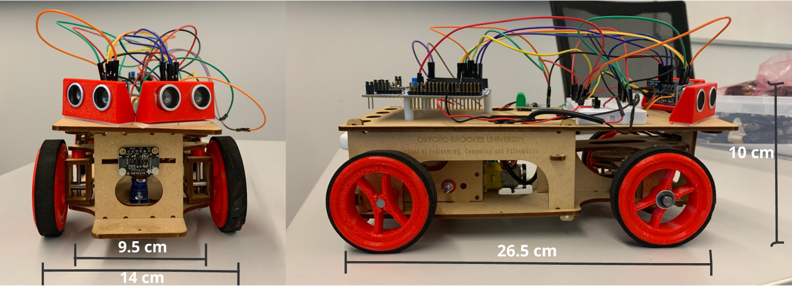

# Autonomous Robot Control System

## Overview
This project presents the design and implementation of a real-time embedded control system for autonomous robot navigation. The system uses sensor-based feedback and a Proportional-Derivative (PD) controller to achieve stable movement under different environmental conditions.

The robot was tested under three scenarios:
- Straight corridor navigation
- Zig-zag corridor navigation
- Dynamic obstacle detection and avoidance

---

## System Architecture

The system integrates:
- STM32 Nucleo-64 microcontroller
- VL53L0X Time-of-Flight (ToF) sensor (front obstacle detection)
- Ultrasonic sensors (left and right distance measurement)
- Motor driver and steering servo

The control system processes sensor inputs and generates steering and speed outputs in real time.

---
## Physical Prototype

The figure below shows the implemented robotic platform used for testing, including sensor placement and system dimensions.

---

## Control Strategy

The robot uses a PD (Proportional–Derivative) controller for steering correction:

u(t) = Kp e(t) + Kd (de(t)/dt)

Where:
- e(t) = left distance − right distance  
- Kp = proportional gain  
- Kd = derivative gain  
- Ki was set to 0 to avoid integral windup during stop-and-resume behaviour.
The controller continuously adjusts the steering angle to minimise lateral error.

---

## Key Features

- Real-time sensor-based navigation  
- Stable centring in straight corridor  
- Adaptive response to zig-zag paths  
- Threshold-based dynamic obstacle detection  
- Implementation of discrete-time feedback control  

---

## Performance Summary

- Straight corridor: Stable behaviour with low lateral error  
- Zig-zag corridor: Increased oscillations due to rapid directional changes  
- Dynamic obstacle: Reliable detection and timely stopping action  
## Testing Results

Detailed testing results for all scenarios can be found here:

[📊 View Detailed Testing Results](testing_results.md)
---

## Limitations

- Performance sensitive to controller gain tuning  
- Oscillations observed in complex paths (underdamped response)  
- Ultrasonic sensor noise affects measurement accuracy  
- Control delay (~50–100 ms) impacts responsiveness  

---

## Future Improvements

- Adaptive gain tuning for improved stability  
- Sensor filtering to reduce noise effects  
- Higher sampling rate for faster response  
- Advanced control strategies (PID / model-based control)  

---

## Repository Contents

- Main program file: main.cpp
- Required libraries: SRF05.lib and VL53L0X.lib
- Target platform: STM32 Nucleo-64 / Mbed

---

## Author

Nikhil Sharma  
MSc Mechanical Engineering  
Oxford Brookes University  

---

## License

This project is submitted for academic purposes.
